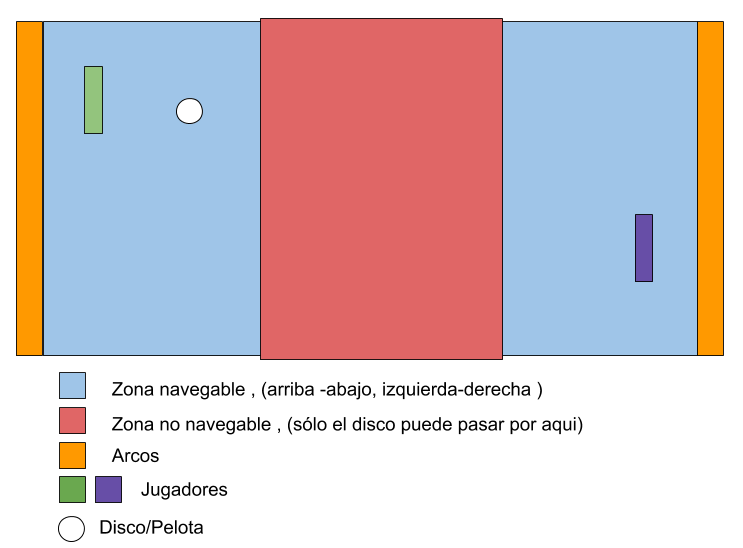

# Ping-Pong-Sinergy
Es una version mejorada con nuevas funcionalidades del famoso juego Ping Pong de Atari. Nos permitirá un rato de entretenimiento y de habilidad con amigos.

Podremos jugar partidas 1 vs 1 o 2 vs 2 con amigos, ver estadísticas y ranking del juego.

## Autor
* **J. Eduardo Arias Barrera** -  [AriasAEnima](https://github.com/AriasAEnima)

## Descripción del Juego:
Dispondremos de información y vistas similares:

 Reglas | Puntuaciones
---|---|
 |  |

Ranking | Salas
---|---
 | 

## 1 vs 1

En esta modalidad de juego nos permitirá movernos en dos dimensiones (como el hockey de aire que vemos en los salones de juegos).

#### Reglas de sencillos:
* Podremos utilizar todas las paredes que no correspondan al arco como rebote.
* El que alcance cierta cantidad de "goles" en el arco será el ganador de la partida.
* El juego solo nos permitirá estar en la zona navegable.

Un ejemplo de lo que podría ser la mesa de juego:

# 2 vs 2

Lo mas interesante de esta nueva version multijugador online es que nos permitirá jugar dobles con unas reglas **adicionales** particulares parecidas las de tenis de mesa en dobles:
* Se debe mantener un orden para golpear la pelota. Por ejemplo Si existe un equipo A que inicia y otro B , y se debe mantener durante la definición del punto un orden A1-B1-A2-B2 o
A2-B1-A1-B2 o A2-B2-A1-B1 etc ... ; solo será permitido utilizar paredes laterales entre este orden. (Golpear al Compañero de equipo también invalidara el punto).

* El tamaño del "arco" es todo la zona del fondo.
* Los jugadores de un mismo equipo no se pueden sobreponer.

Un ejemplo grafico:

Respuesta 1 | Respuesta 2
----|----|
 | 
Aqui Verde inicia. | Café decide responder atras para que Rosado tenga que cruzar el campo , Morado se ubica de tal forma de que no estorbe a la respuesta de Café. |

Respuesta 3 | Respuesta 4
----|----
 | 
Rosa y Verde responden intercambiando de posición. | Morado se adelanta para que Verde tenga que cruzar el campo.

Esto se repetirá hasta que un equipo se equivoque en el orden o se logre poner el disco en el arco.

Esto implica que además de lograr golpear el disco/pelota se debe coordinar con el compañero para su turno de golpear y para que este no le estorbe a la hora de hacerlo.

## Historias de Usuario

#### 1) Como Usuario Quiero conocer la reglas de juego.
####  Criterios de aceptación:
* Se muestra una pantalla de reglas de juego con ilustraciones útiles.

#### 2) Como Usuario Quiero crear una cuenta, para guardar mis estadísticas y poder jugar.
#### Criterios de aceptación:
* Se pedirá un login o un registro
* Se puede crear un usuario, con un nick y una contraseña.

#### 3) Como Usuario Quiero entrar a una sala con un jugador. (1 vs 1)
####  Criterios de aceptación:
* Se puede ingresar a una sala dos jugadores.
* Se puede configurar para un juego 1 vs 1.

#### 4) Como Usuario Quiero jugar Ping-Pong-Sinergy contra otro jugador.
####  Criterios de aceptación:
* Se puede iniciar una partida de Ping-Pong-Sinergy contra otro jugador.
  * Se muestran puntaciones en tiempo real.
* Cumple con las reglas de juego determinadas de "sencillos".

#### 5) Como Usuario Quiero ver mis estadísticas.
####  Criterios de aceptación:
* Se muestra una tabla o similar que muestren datos del usuario que resuman sus partidas.

#### 6) Como Usuario Quiero ver los mejores jugadores.
####  Criterios de aceptación:
* Se muestra una tabla que muestren los mejores jugadores en base a sus estadísticas.

#### 7) Como Usuario Quiero entrar a una sala con 3 jugadores mas (2 vs 2) y establecer equipos.
####  Criterios de aceptación:
* Se puede ingresar a una sala cuatro jugadores.
* Se puede configurar equipos y un juego de dobles.

#### 8) Como Usuario Quiero jugar Ping-Pong-Sinergy en parejas.
####  Criterios de aceptación:
* Se puede iniciar una partida de Ping-Pong-Sinergy modo dobles.
  * Se muestran puntaciones en tiempo real.
  * Se muestra la permutación del orden y demás información del juego en dobles.
* Cumple con las reglas de juego determinadas de "dobles".

## Licencia

This project is licensed under the MIT License  - see the [LICENSE](LICENSE) file for details
